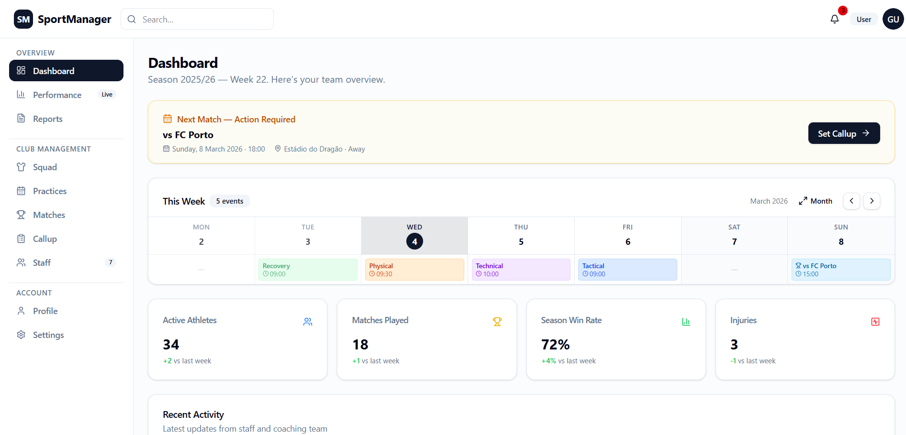
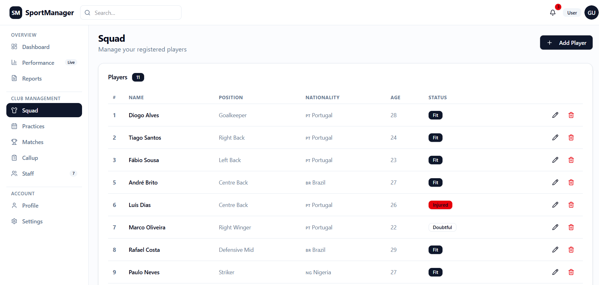

# SportManager

A modern sports club management web application built with React 19, TypeScript, Vite, Tailwind CSS v4, and shadcn/ui.

---

## Screenshots

### Dashboard


> Season overview with a next-match reminder, weekly calendar strip, key stats cards (active athletes, matches played, win rate, injuries), and recent activity feed.

### Squad


> Full player roster with jersey number, position, nationality, age, and fitness status (Fit / Injured / Doubtful). Inline edit and delete actions, plus an Add Player flow.

### Performance Analytics


> Live performance charts — goals scored vs. conceded per matchweek, results breakdown, pass accuracy trends, and possession split — powered by Recharts.

---

## Features

| Area | Details |
|---|---|
| **Auth** | Login and sign-up pages with a protected-route layout |
| **Dashboard** | Weekly calendar, next-match callup reminder, season KPI cards |
| **Squad** | Player list, player detail page, 1–5 star evaluations with per-match stats (goals, assists, faults, cards, minutes) |
| **Practices** | Week calendar with session chips, expand to full monthly modal view, practice detail with evaluation |
| **Matches** | Match list, match detail with score hero, notes, and evaluation section; "Create Report" shortcut |
| **Reports** | Report list with type/status badges, rich detail pages, and a **Create Match Report** form |
| **Callup** | Select players and staff for the next match, confirm callup |
| **Staff** | Staff roster with role and contact details |
| **Performance** | Four analytics charts (goals, results, pass accuracy, possession) |
| **Profile / Settings** | User profile and app settings pages |

---

## Tech Stack

- **React 19** + **TypeScript**
- **Vite 6** (dev server & build)
- **Tailwind CSS v4** via `@tailwindcss/vite`
- **shadcn/ui** — new-york style, slate base, CSS variables
- **React Router v6** — client-side routing
- **Recharts** — performance charts
- **Lucide React** — icon library

---

## Getting Started

```bash
# Install dependencies
npm install

# Start the dev server
npm run dev

# Type-check
npx tsc --noEmit

# Production build
npm run build
```

The app runs at **http://localhost:5173** by default.

---

## Project Structure

```
src/
├── assets/
├── components/
│   ├── evaluations/     # EvaluationSection (stars + match stats)
│   ├── layout/          # DashboardLayout, Header, Sidebar
│   ├── practices/       # WeekCalendar, MonthCalendarModal
│   └── ui/              # shadcn/ui primitives
├── contexts/
│   └── AuthContext.tsx
└── pages/
    ├── AnalyticsPage.tsx
    ├── CallupPage.tsx
    ├── CreateMatchReportPage.tsx
    ├── DashboardPage.tsx
    ├── LoginPage.tsx / SignUpPage.tsx
    ├── MatchDetailPage.tsx / MatchesPage.tsx
    ├── PlayerDetailPage.tsx
    ├── PracticeDetailPage.tsx / PracticesPage.tsx
    ├── ReportDetailPage.tsx / ReportsPage.tsx
    ├── SquadPage.tsx
    ├── StaffDetailPage.tsx / UsersPage.tsx
    └── ProfilePage.tsx / SettingsPage.tsx
```