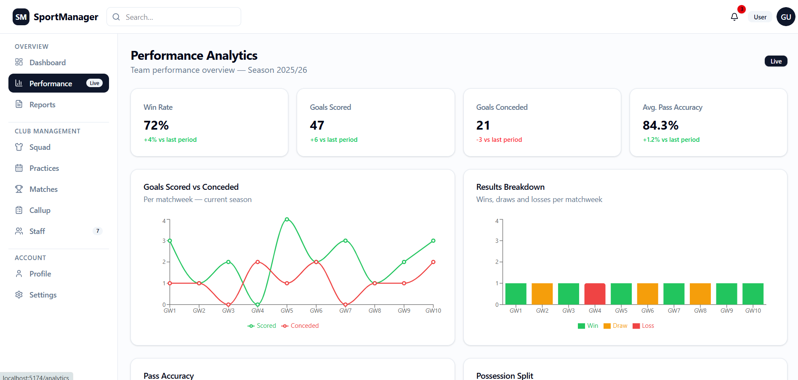

# SportManager

A modern sports club management web application built with React 19, TypeScript, Next.js 16 (App Router), Tailwind CSS v4, and shadcn/ui.

---

## Screenshots

### Dashboard


> Season overview with a next-match reminder, weekly calendar strip, key stats cards (active athletes, matches played, win rate, injuries), and recent activity feed.

### Squad


> Full player roster with jersey number, position, nationality, age, and fitness status (Fit / Injured / Doubtful). Inline edit and delete actions, plus an Add Player flow.

### Performance Analytics


> Live performance charts — goals scored vs. conceded per matchweek, results breakdown, pass accuracy trends, and possession split — powered by Recharts.

---

## Features

| Area | Details |
|---|---|
| **Auth** | Login and sign-up pages with social providers (Google, GitHub, Microsoft); protected-route layout via Zustand auth store |
| **Dashboard** | Weekly calendar strip, next-match callup reminder, season KPI cards, recent activity feed |
| **Squad** | Player list with full CRUD, player detail page with season stats, 1–5 star evaluations with per-match stats (goals, assists, faults, cards, minutes) |
| **Practices** | Week calendar with session chips, expand to full monthly modal view, practice detail with drill attachment and evaluation |
| **Matches** | Match list with full CRUD, match detail with score hero, notes, and evaluation section; "Create Report" shortcut |
| **Reports** | Report list with type/status badges, rich detail pages, and a **Create Match Report** form |
| **Callup** | Select players and staff for the next match, confirm callup |
| **Drill Library** | Browse, create, edit, and delete drills; filter by category/level; attach drills to practice sessions |
| **Staff** | Staff roster with full CRUD and role/contact detail pages |
| **Performance** | Four live analytics charts (goals scored vs. conceded, results breakdown, pass accuracy, possession split) |
| **Profile / Settings** | User profile editing and notification preference settings |

---

## Tech Stack

- **React 19** + **TypeScript**
- **Next.js 16** (App Router, file-based routing, server/client components)
- **Tailwind CSS v4** via `@tailwindcss/postcss`
- **shadcn/ui** + **Radix UI** — new-york style, CSS variables
- **TanStack Query v5** — data fetching, caching, and optimistic mutations
- **Zustand v5** — auth state management
- **react-hook-form** + **Zod** — form handling and schema validation
- **next-themes** — dark / light / system theme switching
- **Recharts** — performance analytics charts
- **Sonner** — toast notifications
- **Lucide React** — icon library

---

## Getting Started

```bash
# Install dependencies
npm install

# Start the dev server
npm run dev

# Type-check
npx tsc --noEmit

# Production build
npm run build
```

The app runs at **http://localhost:3000** by default.

---

## Project Structure

```
src/
├── app/
│   ├── (auth)/              # Login and sign-up pages
│   └── (protected)/         # Authenticated layout (Header + Sidebar)
│       ├── dashboard/
│       ├── analytics/
│       ├── squad/[id]/
│       ├── practices/[id]/
│       ├── matches/[id]/
│       ├── drills/[id]/
│       ├── reports/[id]/
│       ├── reports/new/match/
│       ├── callup/
│       ├── users/            # Staff roster
│       ├── staff/[id]/
│       ├── profile/
│       └── settings/
├── components/
│   ├── evaluations/          # EvaluationSection (stars + match stats)
│   ├── layout/               # Header, Sidebar
│   ├── practices/            # WeekCalendar, MonthCalendarModal
│   └── ui/                   # shadcn/ui primitives
├── lib/
│   ├── api/                  # Per-entity async service functions
│   ├── queries/              # TanStack Query hooks (useQuery + useMutation)
│   ├── mock-data.ts          # Seed data (replace with real API)
│   └── types.ts              # Shared TypeScript types
├── providers/
│   ├── QueryProvider.tsx     # TanStack Query client + global error toasts
│   └── ThemeProvider.tsx     # next-themes wrapper
├── schemas/                  # Zod validation schemas
└── store/
    └── authStore.ts          # Zustand auth store
```
